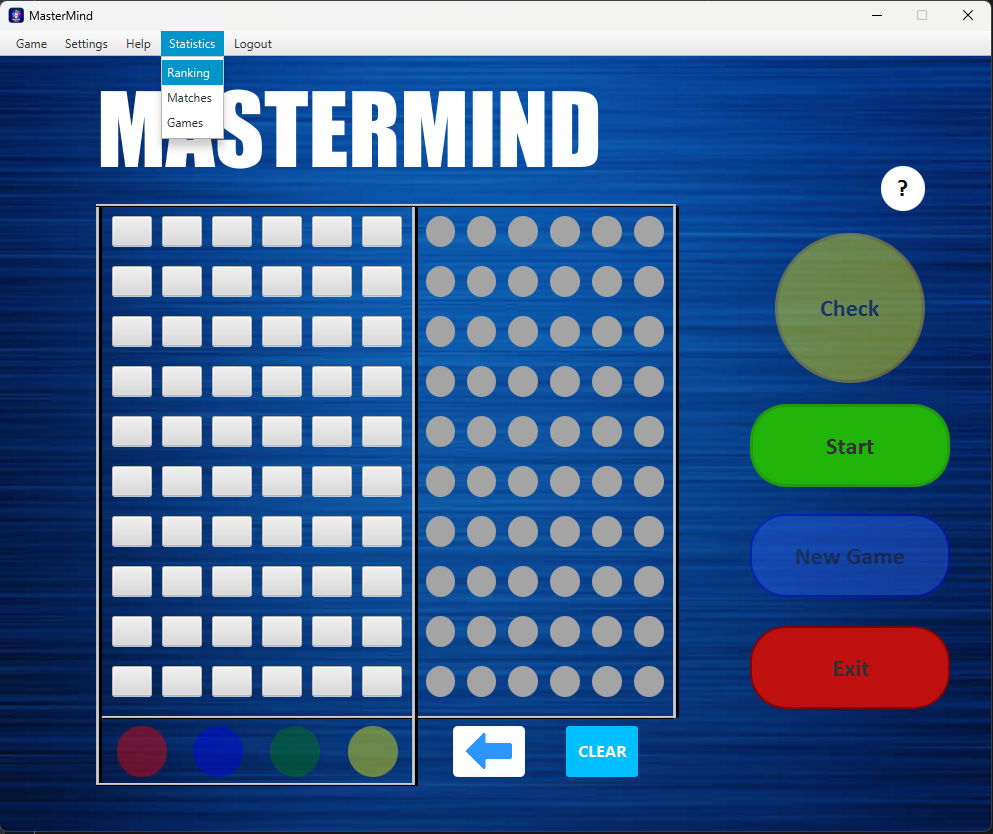
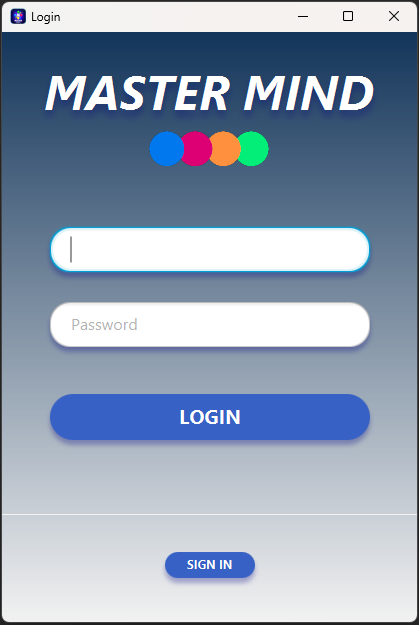
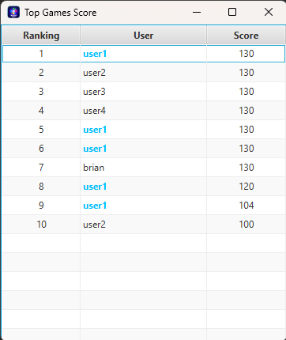
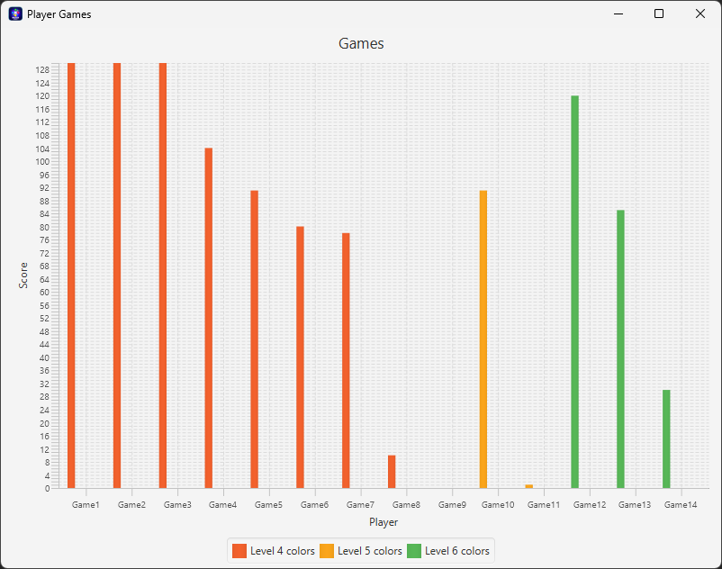

# Mastermind - Aplicación de Juego Lógico

La aplicación Mastermind desarrollada en Java 8 con JavaFX , presenta una solución interactiva para disfrutar del clásico juego lógico. Este proyecto refleja un compromiso con la creación de una herramienta eficiente y fácil de usar, mejorando la experiencia de entretenimiento y lógica para los usuarios.

## Capturas de Pantalla

&nbsp;&nbsp;
&nbsp;&nbsp;
&nbsp;&nbsp;

## Características Destacadas

### Actualizaciones en Tiempo Real

Garantiza la actualización constante de los datos mediante una conexión a una fuente de datos en tiempo real. Esto asegura que los usuarios siempre cuenten con información actualizada sobre el estado y progreso del juego.

### Diseño Dinámico de Cuadrícula

Implementa un diseño de cuadrícula dinámica que se ajusta de manera inteligente a 4, 5 o 6 columnas según el nivel de dificultad seleccionado. Este enfoque ofrece una interfaz visualmente atractiva y adaptativa.

### Barra de Menú Completa

Incorpora una barra de menú completa que proporciona acceso rápido a funciones esenciales, como Juego, Configuración, Ayuda, Estadísticas y Cerrar Sesión. Esto facilita una experiencia de usuario intuitiva y completa.

### Registro de Usuarios e Identificación

El juego inicia con una ventana de identificacion que permite cargar datos del usuario existente, tambien permite el registro de nuevos usuarios.

### Estadisticas de los jugadores

Ranking actualizado constantemente que muestra las mejores partidas de los jugadores más destacados, grafico que muestra las partidas del jugador conectado segun el nivel. 

## Instalación

1. Clona o descarga el proyecto desde el repositorio de GitHub [enlace al repositorio].

2. Asegúrate de tener Java 8 y JavaFX configurados en tu sistema.

3. Explora el código fuente para comprender la implementación de las diferentes características y su integración en la aplicación.

 
Mastermind es un proyecto de aprendizaje explora las características y desarrolla con Mastermind.